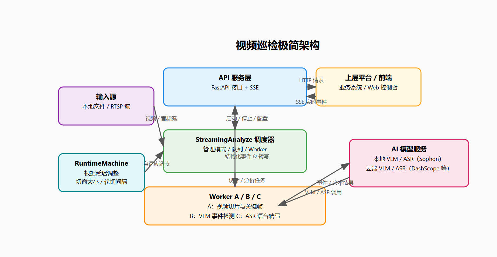

<!--
 * @Author: 13594053100@163.com
 * @Date: 2025-11-25 13:46:04
 * @LastEditTime: 2025-11-27 15:44:23
-->
# JetLinksAI Video Inspection

多路视频智能巡检与离线视频解析后端服务，支持 **RTSP 实时流** 与 **本地音/视频文件**，在 **边缘盒子（Sophon TPU）** 或云端运行 **VLM + ASR**，输出结构化安防事件与多模态摘要，通过 **SSE** 推送给上层平台。

---

## 🚀 项目定位

作为企业级 **「视频智能巡检能力层」**，聚焦解决：

- 多路 RTSP 统一管理与轮询巡检
- 视频按时间窗口切片 + 自适应关键帧抽取
- 本地/云端 VLM 安防事件检测与画面理解
- 本地/云端 ASR 语音转写
- 利用算能边缘计算盒子Sophon SDK 部署的本地Bmodel模型, 完成视觉描述与安防任务

典型应用：工厂 / 园区 / 楼宇安防巡检、大规模历史视频离线分析、边缘端多模态推理服务。

---

## ✨ 核心特性 & 技术亮点

- **多路 RTSP 轮询**
  - 支持 **2–50 路摄像头** 轮询
  - 每路可独立设置 切窗个数、系统提示词
  - 运行时可动态增删流、调整轮询间隔

- **多模态流水线**
  - 视频切片 + 关键帧抽取 → VLM 推理 → ASR 转写
  - 支持本地 Qwen-VL（Sophon TPU）与云端 VLM 切换
  - 支持本地 / 云端 ASR，统一输出时序文本

- **安防场景抽象**
  - 内置 系统提示词，覆盖 10 个安防/合规场景
  - 每个场景 3 条监督目标，统一事件结构与严格JSON输出格式

- **自适应性能调节**
  - 本地多模态模型运行时状态机能够基于推理延迟自动调整：
    - 切片窗口 `cut_window_sec`
    - 轮询间隔 `polling_batch_interval`
  - 面向算力受限设备的稳定运行能力

- **工程化与扩展性**
  - 基于 FastAPI + Pydantic，配置严格校验
  - 多队列 + `_STOP` 标识的 Worker 事件总线协调，支持暂停/恢复/优雅退出
  - SSE 事件总线易于对接前端与 IoT 平台

---

## 🗺️ 架构概览

## ⚙️ 运行模式
- OFFLINE：离线音/视频解析
- SECURITY_SINGLE：单路 RTSP 常驻安防巡检
- SECURITY_POLLING：多流RTSP轮询安防巡检

## 📦 流水线与 Worker 简述
本项目内部采用「主控 + 多 Worker」的分层流水线模型：由 `StreamingAnalyze` 统一负责输入源管理、配置加载和线程生命周期，根据运行模式（离线文件 / 单路安防 / 多路轮询）按需启动各条处理链路，并通过有界队列解耦模块，通过统一事件流对外输出结果。

- **A 线：切片 Worker（`worker_a_cut`）**  
  从 RTSP 或本地音视频源读取数据，按照配置的时间窗口进行切片，抽取关键帧并截取对应音频片段，将「视频任务」和「音频任务」分别投递到下游队列。该 Worker 是整条流水线的生产者，负责补全时间戳、流编号、轮次等元信息。

- **B 线：VLM Worker（`worker_b_vlm`）**  
  消费视频任务，调用本地或云端多模态模型，对关键帧/画面进行理解与事件识别。支持按模式切换系统提示词（离线分析 / 安防场景），输出结构化告警或描述性文本，并将结果写入统一的 VLM 事件队列，供上层服务订阅或落库。

- **C 线：ASR Worker（`worker_c_asr`）**  
  消费音频任务，对含语音片段进行识别与增量转写，对静音片段进行快速过滤。支持本地/云端 ASR 后端，输出句级增量结果与切片级最终结果，统一写入 ASR 事件队列。

三条 Worker 通过控制队列接收 `START/STOP` 等指令，通过事件队列向外暴露标准化的 VLM/ASR 结果。这样的设计既方便在资源受限的边缘设备上按需裁剪某条链路（仅视频 / 仅音频），也便于后续新增其它类型的 Worker 在同一流水线上协同工作。

## 🤖 本地边缘测多模态模型运行时状态机简述
在本地边缘测多模态推理链路上引入了一个轻量级的运行时状态机 `LocalVlmRuntimeMachine`，用于根据 **实际 VLM 推理延迟** 动态调整切片窗口和轮询间隔，从而在边缘设备上尽量在「可接受延迟」与「有限算力」之间自动寻优。该状态机仅在启用了本地 VLM 且配置 `runtime_machine_config.local_vlm_runtime_machine = True` 时生效，初始化失败时会自动降级为普通固定配置模式。

状态机的核心输入是 Worker B 产生的 `vlm_stream_done` 事件中的 `latency_ms` 字段：  
它维护一个滑动窗口统计平均延迟，并按一定事件间隔做检查：
- 若平均延迟长期偏高（超过 high / panic 阈值），则 **放宽配置**：适度增大 `cut_window_sec`，在轮询模式下同时增大 `polling_batch_interval`，以减少单位时间内的 VLM 调用频次、降低负载；
- 若平均延迟持续处于正常甚至偏低区间，则 **收紧配置**：在安全范围内将 `cut_window_sec` / `polling_batch_interval` 逐步拉回基础值，提升时间分辨率与响应速度；
- 阈值可由上游显式配置，也可在采集到一定数量样本后自动估计，内部带有「最小调整间隔」「硬上下限」和「多轮稳定后 snap 回基础值」等保护逻辑，避免频繁抖动。

## 🧩 自适应关键帧抽取算法简述
关键帧选择逻辑实现于 `worker_a_cut.py` 的 `pick_best_change_frame_with_pts`，核心思路是：对每段切片做稀疏采样，然后用「颜色变化比例 + 结构相似度」计算变化得分，从中选出若干关键帧。

1. **候选帧采样**

   对每个切片 `video_path`，按步长 `stride` 从头到尾稀疏采样若干帧作为候选，并记录帧号 `idx` 与相对时间戳：

   $$\mathrm{pts} = \mathrm{seg\_t0} + \frac{\mathrm{idx}}{\mathrm{fps}}$$

2. **计算两类变化量**

   对每个候选帧，先缩放到固定宽度并转灰度，然后与上一候选帧计算：

   - `bgr_ratio_score`：颜色变化比例，范围 $[0,1]$，越大说明像素有变化的比例越高；
   - `ssim_gray`：灰度图结构相似度 SSIM，范围 $[0,1]$，越大说明两帧越相似。

   对两帧灰度向量 $x,y$（长度为 $N$），先定义：

   $$\mu_x = \frac{1}{N}\sum_{i=1}^N x_i,\quad
     \mu_y = \frac{1}{N}\sum_{i=1}^N y_i$$

   $$\sigma_x^2 = \frac{1}{N}\sum_{i=1}^N (x_i - \mu_x)^2,\quad
     \sigma_y^2 = \frac{1}{N}\sum_{i=1}^N (y_i - \mu_y)^2$$

   $$\sigma_{xy} = \frac{1}{N}\sum_{i=1}^N (x_i - \mu_x)(y_i - \mu_y)$$

   取常数 $C_1 = (0.01 \times 255)^2,\ C_2 = (0.03 \times 255)^2$，则 SSIM 为：

   $$\mathrm{SSIM}(x,y) =
     \frac{(2\mu_x\mu_y + C_1)(2\sigma_{xy} + C_2)}
          {(\mu_x^2 + \mu_y^2 + C_1)(\sigma_x^2 + \sigma_y^2 + C_2)}$$

3. **关键帧打分与选取**

   当前帧的变化得分定义为：

   $$\mathrm{score}
     = \alpha_{\mathrm{bgr}} \cdot \mathrm{bgr\_ratio\_score}
       + (1 - \alpha_{\mathrm{bgr}})\cdot (1 - \mathrm{SSIM})$$

   其中 `alpha_bgr` 即 $\alpha_{\mathrm{bgr}}$，控制「颜色变化」与「结构变化」的权重。  
   函数对所有候选帧按 `score` 降序排序，取前 `topk_frames` 个，再按帧号升序排成时间顺序，将对应帧写入 `out_dir`，最终返回：

   - 关键帧路径列表 `paths`
   - 相对时间戳列表 `pts_list`
   - 帧索引列表 `idxs`

